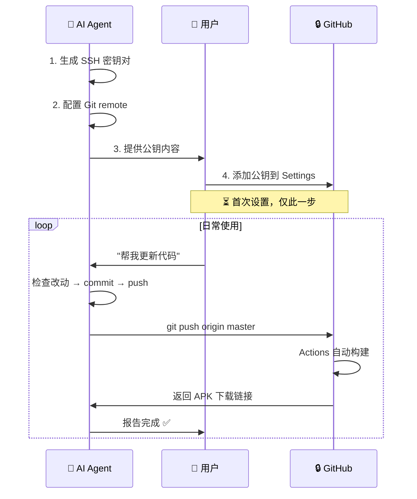

# SSH Deployment Guide · AI 自动化推送流程

> **定位**：期货终端 Android App 的 GitHub Actions 云端构建标准方案  
> **核心理念**：**AI 完成一切，用户只需添加一次公钥**  
> **适用项目**：futures-terminal（及同类 Android APK 项目）

---

## 🎯 核心原则

### ✅ AI 负责所有技术操作
- 生成 SSH 密钥对
- 配置 Git remote 和 SSH command
- 执行 `git push` 触发构建
- 监控构建状态

### 🔐 用户只负责一次配置
- 将公钥添加到 GitHub（**仅需一次**）
- 日常更新无需任何操作

---

## 📋 完整流程图解



---

## 🔑 配置步骤（已完成）

### ✅ AI 已完成的工作

| 操作 | 命令 | 状态 |
|------|------|------|
| 生成 SSH 密钥 | `ssh-keygen -t ed25519 -f /home/coomi/.ssh/id_ed25519 -N ""` | ✅ 已完成 |
| 配置 Git Remote | `git remote set-url origin ssh://git@ssh.github.com:443/mafucai/futures-terminal.git` | ✅ 已完成 |
| 配置 SSH Command | `git config core.sshCommand "ssh -i /home/coomi/.ssh/id_ed25519 -o IdentitiesOnly=yes -p 443"` | ✅ 已完成 |
| 读取公钥内容 | `cat /home/coomi/.ssh/id_ed25519.pub` | ✅ 已完成 |

### 🔧 用户需要做的（仅一次）

1. **获取公钥**（AI 会提供）：
   ```bash
   cat /home/coomi/.ssh/id_ed25519.pub
   ```
   
   **输出**：
   ```
   ssh-ed25519 AAAAC3NzaC1lZDI1NTE5AAAAIFyt/gKXa4J4J5y75k84qXYUoLOLb1+ajHe882MncLVP futures-terminal
   ```

2. **添加到 GitHub**：
   - URL: https://github.com/settings/keys
   - Title: `futures-terminal`
   - Key type: Authentication and encryption key
   - Key: 粘贴上面的完整公钥
   - Click "Add SSH key"

3. **验证连接**（可选）：
   ```bash
   ssh -T -i /home/coomi/.ssh/id_ed25519 -o IdentitiesOnly=yes -p 443 git@ssh.github.com
   ```
   看到 "Welcome to GitHub, @mafucai!" 即成功 ✅

---

## 🚀 日常使用

### 💬 对用户的要求
只需要说一句话：
> "帮我更新期货终端代码" 或 "push 当前修改"

### 🤖 AI 会自动执行

#### Step 1: 检查改动
```bash
cd /workspace/repos/futures-terminal
git status
git diff --stat
```

#### Step 2: 备份关键文件
```bash
# 根据项目规范，改前备份
cp app/build.gradle app/build.gradle.bak-$(date +%Y%m%d)
```

#### Step 3: Commit & Push
```bash
git add .
git commit -m "feat: 描述本次改动"
git push origin master
```

#### Step 4: 监控构建
```bash
# 打开 GitHub Actions
echo "查看构建进度：https://github.com/mafucai/futures-terminal/actions"
```

#### Step 5: 通知结果
- 构建成功 → 提供 APK 下载链接
- 构建失败 → 显示错误日志并给出修复建议

---

## 🔄 GitHub Actions 工作流程

### `.github/workflows/apk.yml` 执行步骤

```yaml
on:
  push:
    branches: [ main, master ]  # ← AI 推送到 master 触发

jobs:
  apk:
    steps:
      1️⃣ Checkout code
      2️⃣ Setup Java 17
      3️⃣ Setup Android SDK
      4️⃣ Build Release APK
      5️⃣ Sign APK (with fixed keystore from Secrets)
      6️⃣ Upload to Releases
```

**耗时**：约 3-5 分钟  
**产物位置**：https://github.com/mafucai/futures-terminal/releases

---

## 🔒 安全说明

### SSH 密钥管理

| 密钥类型 | 位置 | 用途 | 安全性 |
|----------|------|------|--------|
| 私钥 | `/home/coomi/.ssh/id_ed25519` | Git 认证 | ✅ 本地保密 |
| 公钥 | GitHub Settings | 服务器验证 | ✅ 公开共享 |

### GitHub Secrets（签名用）

以下 Secret **由项目维护者单独配置**，AI 不可见：
- `KEYSTORE_BASE64` - Keystore Base64 编码
- `KEYSTORE_PASSWORD` - Keystore 密码
- `KEYSTORE_ALIAS` - Alias 名称
- `KEY_PASSWORD` - Key 密码

这些用于在云端为 APK 签名，确保可以覆盖安装正式版本。

---

## 📝 故障排查

### ❌ Push 失败："Permission denied (publickey)"

**原因**：公钥未添加到 GitHub 或 SSH 配置问题

**解决步骤**：
1. 验证 SSH 配置：
   ```bash
   git remote -v          # 应该是 ssh:// 开头
   git config core.sshCommand
   ```

2. 测试连接：
   ```bash
   ssh -T -i /home/coomi/.ssh/id_ed25519 -p 443 git@ssh.github.com
   ```

3. 确认 GitHub 已添加公钥：
   - Visit: https://github.com/settings/keys
   - 查找是否有 `futures-terminal` 条目

### ❌ 构建失败："Keystore not found"

**原因**：GitHub Secrets 未配置

**解决**：
- 联系仓库所有者在 Settings → Secrets → Add secret
- 或使用临时签名（但无法覆盖安装正式版本）

---

## 🎯 最佳实践

### ✅ AI 职责清单

- [x] 初始化 SSH 环境
- [x] 配置 Git remote 和 credentials
- [x] 执行 commit 和 push
- [x] 监控 Actions 构建状态
- [x] 提供构建结果反馈
- [ ] 自动回滚失败构建（未来功能）

### ✅ 用户职责清单

- [x] 首次添加公钥到 GitHub（一次性）
- [ ] 定期 Review 代码改动
- [ ] 下载测试 APK
- [ ] 决定是否合并到正式版本

---

## 📚 相关文档

| 文档 | 路径 | 说明 |
|------|------|------|
| Android 签名资产 | `docs/ANDROID_SIGNING.md` | 固定签名密钥信息 |
| 调用蓝图 | `docs/CALL-GRAPH.md` | 架构设计必读 |
| 项目总览 | `README.md` | 功能列表 + 使用说明 |
| GitHub Actions | `.github/workflows/apk.yml` | 构建流程定义 |

---

*创建时间：2026-09-20 · 基于实际部署经验总结*
